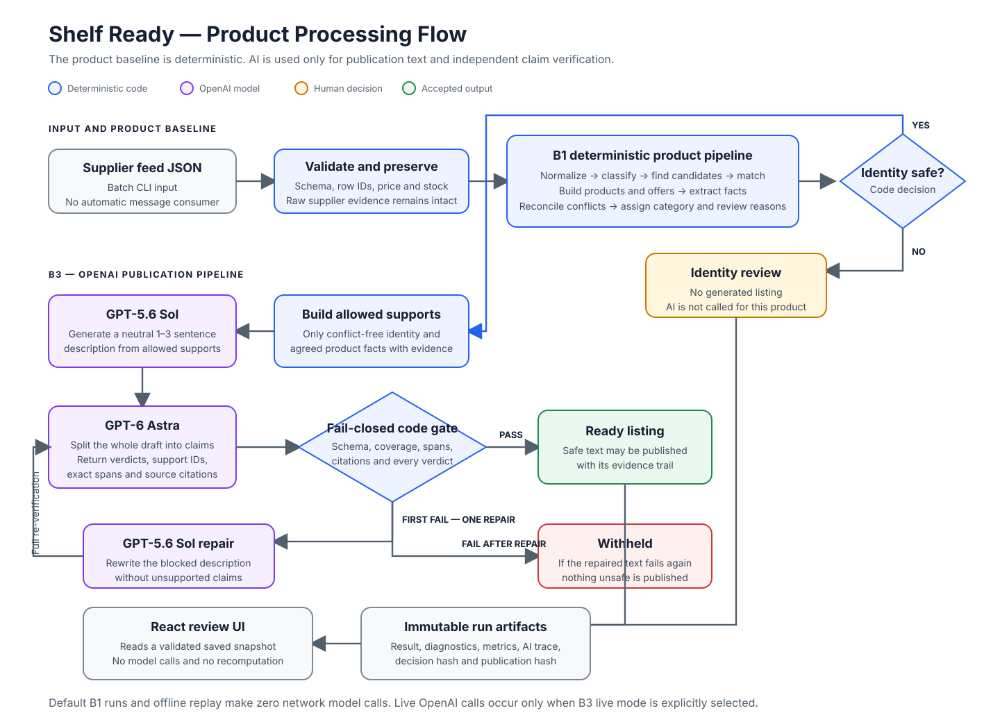

# Shelf Ready — B1 product baseline and B3 publication development

Local pipeline: JSON → validation → offers → explicit facts and evidence → candidates and compatible products → categories, reconciliation and review → generation → atomic claims → independent verification → development/holdout eval and saved metrics. The accepted product baseline is **B1-v2**; B3 publication is built on top of it and does not use B2. The human-verified development gate P0.2 passed and reproduces offline; full-input B3 and holdout replay are saved. The final screen contains Catalog and one compact matching Review.

Stack: TypeScript 5.9, NestJS 12 standalone context, Node 24.14.1, npm; UI — Vite + React in `web/`. No HTTP API, database, or deployment required.

## Code architecture

The CLI calls a thin `PipelineService`, which dispatches to separate B0/B1, B2, B3, and comparison services. Pure matching, fact, reconciliation, publication, and evaluation functions remain independent of Nest. `RunStoreService` owns immutable filesystem artifacts, while `AiModule` owns provider registration. See [Architecture](docs/ARCHITECTURE.md).

Run the complete local verification gate with:

```sh
npm run verify
```

## Product flow

[](docs/assets/product-flow.svg)

The diagram shows the accepted production runtime: deterministic B1 owns product identity, matching and facts; OpenAI B3 writes and verifies publication text behind a fail-closed code gate. [Open the SVG directly](docs/assets/product-flow.svg).

### Production stages

| Stage | Runtime used | Responsibility | Current status |
|---|---|---|---|
| **B1** | Deterministic TypeScript code | Product identity, matching, offers, facts, conflicts and categories | Accepted product baseline |
| **B3** | **OpenAI** (`gpt-5.6-sol`, `gpt-6-astra`) plus a deterministic gate | Generate listing text from B1 supports and independently verify every claim | Accepted publication pipeline |

Historical B2 model experiments are not part of this runtime. Their scope and results are preserved in the [stage 3 report](docs/STAGE3_REPORT.md).

## Install and run

With Node from `.nvmrc`:

```sh
npm ci
npm run typecheck
npm test
npm run pipeline
npm run eval
```

### Results screen

A separate Vite app in [`web/`](web/) reads a prepared pipeline result and shows the run provenance. Demo data is not substituted. No API key is required.

```sh
npm --prefix web ci
npm run web:prepare -- --run-dir reports/B3-openai-full-input-atomic-v2-holdout-replay
npm run web
```

Build: `npm run web:build`. [Full instructions and URL override](web/README.md). The final B3 UI keeps two user tabs: **Catalog** and **Review**. Review shows 20 independent matching questions, one per screen, with answers same product / different products / not enough information (for a single row — product / non-product / unknown). After all answers and a reviewer name it exports `matching-audit-human-verified.json`. Completed listing-text and controlled-verifier review remains in saved artifacts and automated tests, but does not require a new manual tab. The draft is stored in `localStorage` bound to version and `decisionsHash`; the screen does not call models or change the original run.

`pipeline` and `eval` run the same full pipeline with development evaluation. B1 is the default; each run creates a new directory under ignored `reports/local/`. To keep results in the repository for future charts, use `--out reports`:

```sh
npm run pipeline -- --baseline b1 --out reports --run-id my-b1
npm run eval -- --baseline b1 --out reports --run-id my-b1-repeat
npm run pipeline -- --baseline b0 --out reports --run-id my-b0-control
npm run compare -- --before reports/B0 --after reports/my-b1 --out reports/comparisons --run-id my-b1
npm run benchmark -- --runs reports/B0,reports/my-b1,reports/my-b1-repeat --out reports/benchmarks --run-id my-history
```

Existing run IDs and comparison/export directories are not overwritten. Commands do not commit or push.

Paths are set with `--feed`, `--taxonomy`, `--labels`, `--checks`, `--out`. CLI overrides values from `.env` / `FEED_PATH`, `TAXONOMY_PATH`, `LABELS_PATH`, `REPORTS_DIR`, then the default files. There is no environment variable for `--checks`; the default is `eval/stage2-checks.json`. Example variables are in `.env.example`; `.env` and `.env.{NODE_ENV}` are read at startup, and secrets are not committed. B0/B1 do not need an API key.

Checks are bound to a specific feed hash and the selected split rows. For a different feed, pass matching labels/checks; do not apply ready-made labels to new data. B0 does not use stage2-checks. `--split development|holdout` sets the evaluation split; holdout for B3 is allowed only in replay/full_input, so this command cannot accidentally make live API calls.


## Decisions and contracts

Input sources are never modified. Validation checks types, unique row_id and supplier/SKU, stock, and exactly 12 categories. Non-products are determined by content, not stock or row_id. Each row has exactly one outcome; originals, including extra fields, are kept in `rows[].source`.

B0 groups by trim + whitespace + lowercase title and reproduces the previous decisions hash. B1 emits a shared `rows/groups` projection plus:

- `products`: membership, identity features, category, separate identity and category confidence, reconciled attributes, and review links.
- `offers`: one offer per row, including rejected ones (`productId = null`); supplier/SKU, exact price, stock, condition, and offer-fact links.
- `facts`: attribute, value, unit, product/offer scope, conditions, exact quote with row_id/field/offsets, transform rule, and mass rounding interval.
- `candidates`: considered pairs and merge/reject/review with reasons. A missing pair means candidate search never proposed it.
- `unparsed`: fully or partially unparsed specs fragments kept whole. `review`: messages with row_ids/product_ids, reasons, evidence, and fact_ids.

IDs are built deterministically; row permutation does not change the result. Review is an extra queue: a product row can stay grouped and still need review. `rows[].outcome = review` is kept for the separate missing-title case.

### B1 rules

A limited vocabulary recognizes explicit types and development-data forms: Laptop/Notebook, WH-880N/WH880N, TKL/tenkeyless, black/schwarz, and so on. Candidates are found by the meaningful model remainder without known variant markers, or by exact title. Merge requires matching full model/type and compatible known variants; similarity alone does not authorize merge. All cross-group pairs are checked, so an unknown variant does not connect incompatible A–B–C ends.

Pro/Lite/Plus/X differences, generations, capacity/RAM, colors, switches, kits, and power/port counts explicitly stated in the title are preserved. A missing distinguishing value leads to review. The first word is not treated as a brand; Sony/Sony Corp. is explicitly supported, everything else stays unknown. OPEN BOX/new in box belong to the offer.

Limited extraction covers mass, duration, screen, memory, power, speed, interfaces, IP/ATM, camera traits, keyboards, and explicit features. Read/unspecified direction, up_to, with_case, charging_case, PD passthrough, compatible_device, and maximum are preserved. For example, USB-C Ladecase belongs to the charging case. Unsupported qualifiers and compatibility notes are not turned into unconditional facts. This is not a universal multilingual parser or a semantic verifier.

Mass normalizes to grams: kg=1000g, oz=28.349523125g, lb=453.59237g. Tolerance equals half the last decimal place of the source number after conversion. Reconciliation requires a common intersection of all intervals. The representative is the observation with the widest interval, then by row_id/fact ID on ties; that is a display-value selection rule, not supplier priority. Nimbus 1.2kg/42oz and LedgerLite 1.3kg/2.9lbs reconcile. Time converts to hours; GB/TB are not converted into each other without a unit policy. There is no universal tolerance for other fields.

Facts group by attribute: same values/conditions reconcile; different values under the same conditions are held as conflict; different units/conditions are incomparable. This is a conservative policy: with multiple contexts the whole attribute is held. A missing value is not a conflict. There is no voting, averaging, external knowledge, or automatic supplier preference.

Categories come from a closed taxonomy. Accessories are recognized before primary devices; ear tips/cases/sleeves → other, ordinary mouse → other, gaming mouse/keyboard → gaming_accessories, USB-C hub → chargers_cables. Unknown type → other with review. Confidence high/medium/low is an explainable decision signal, not a probability.

Price amounts stay decimal strings with the original currency; `$` means USD by an explicit assumption. There is no FX, suspicious-price correction, or stock summing. Price errors on already rejected non-products stay diagnostics and do not create an unnecessary manual queue.

## Metrics and history

Detailed definitions, denominators, JSONL format, and speed protocol: [BENCHMARKS.md](docs/BENCHMARKS.md).

A successful run contains `result.json`, `diagnostics.json`, `metrics.json`, `report.md`, `report.json`. The last file is written as the success marker. Invalid input creates `failure.json`, returns exit code 1, and does not create a success report; on write failure partial files may remain. Execution success does not mean ground-truth quality or publication readiness.

Extended matching labels: 20 provisional family cases, 14 development on 59 rows / 6 holdout on 49. They cover 108 rows and are not raised automatically. A separate `eval/matching-audit.json` records 20 atomic human questions. The saved human export and metrics are [matching-audit-human-verified.json](eval/matching-audit-human-verified.json) and [matching-audit-metrics.json](eval/matching-audit-metrics.json): 20/20 reviewed, 18/18 agreement, 18/20 scored coverage, 2 `unknown`, 0 disagreements (post-holdout validation). `eval/stage2-checks.json` separately holds technical category/fact/reconciliation checks.

`compare` reads schema 1–4, checks decision integrity and matching feed/taxonomy/labels/split. For schema 4 it separately compares `publicationHash`; B1→B3 requires unchanged matching, offers, facts, review, and row outcomes. Unknown schema is rejected. Different inputs/labels → incomparable, deltas N/A, and exit code 1. Growth of known FP, accounting violations, or failed quality checks also give a non-zero code; the comparison is still saved. For historical B0, full review is N/A, not the former zero of a different metric.

Current artifacts:

- [Accepted B1-v2](reports/B1-v2/report.md), [repeat](reports/B1-v2-repeat/report.md), [B0 → B1-v2](reports/comparisons/B0-to-B1-v2/comparison.md).
- [Chart data: 8 runs](reports/benchmarks/stage2-v2/observations.jsonl), [run list](reports/benchmarks/stage2-v2/summary.json).
- [Stage 2 outcome and handoff](docs/STAGE2_REPORT.md); [roadmap](docs/ROADMAP.md).

Saved historical runs are not rewritten. Result files are kept locally and intended for Git; there is no automatic upload anywhere. OpenAI B3 results are described in the [stage 4 report](docs/STAGE4_REPORT.md), the local Ollama experiment in the [stage 3 report](docs/STAGE3_REPORT.md), and responsibility split in [model roles](LLM_ROLES.md).

## B3: OpenAI publication generation and verifier

Local `.env` must contain `OPENAI_API_KEY`; the key is loaded through `AppConfig`, has lower priority than process env, and is not saved in artifacts. B3 config is `config/stage4.openai.json`: `gpt-5.6-sol` generates 1–3 short neutral sentences, a separate `gpt-6-astra` splits the whole text into claims and checks evidence. Both use reasoning `low`, Responses API, and strict Structured Outputs.

Development live and replay:

```sh
npm run build
node dist/src/cli.js pipeline --baseline b3 --ai-mode live --ai-cache reports/my-b3-cache --ai-config config/stage4.openai.json --ai-cohort development --claim-checks eval/stage4-claims.json --out reports --run-id my-b3-live
node dist/src/cli.js pipeline --baseline b3 --ai-mode replay --ai-cache reports/my-b3-cache --ai-config config/stage4.openai.json --ai-cohort development --claim-checks eval/stage4-claims.json --out reports --run-id my-b3-replay
```

Each live run needs a new empty cache directory; replay uses exactly that cache and does not call the network. Generated review uses contract `stage4-generated-review-v2`: a model verdict is not a human verdict, every checked claim has explicit `state=reviewed`, `humanVerdict`, and rationale, and atomicity/copy issues are marked separately. The current human-verified file is `eval/generated-review-fdca0138d88f.json`: 76/99 claims, 28/37 cards, and the full fixed sample 20/20.

You can prepare the UI with that labeling without changing the historical run:

```sh
npm run web:prepare -- --run-dir reports/B3-openai-development-verifier-only-v2-human-gate-replay --generated-checks eval/generated-review-fdca0138d88f.json
```

Full-input B3 requires an explicit `--stage4-gate` with a successfully checked development report, human-verified controlled suite, and completed generated-review sample. Factual errors and unresolved `non_atomic_claim` close the gate; `unclear_copy` is measured and disclosed separately. Holdout is not started by this command.

P0.2 moved the verifier to `publication_verification_v2`: the prompt requires finished semantic claims, and the local validator rejects truncated `is a`/`has a` and bare measurements without an attribute. After a diagnostic full development live, a verifier-only run on frozen texts was executed: 49 calls, $2.390245, controlled 12/12, 37/39 ready, and 0 forbidden spans. Human-gate replay gave 49 cache hits, generated 76/99, sample 20/20, factual/non-atomic errors 0/0, and identical publication. The development gate is accepted.

Current development gate: [verifier-only live](reports/B3-openai-development-verifier-only-v2-live/report.md), [human-gate replay](reports/B3-openai-development-verifier-only-v2-human-gate-replay/report.md), and [comparison](reports/comparisons/B3-openai-development-verifier-only-v2-live-to-human-gate-replay/comparison.md). Human-verified controlled gate: 4/4 unsupported, false block 0/7, disputed leakage 0/1, errors 0. Generated review: 76/99 claims, 28/37 products, sample 20/20, factual errors 0, non-atomic 0, unclear-copy 2. Result: 37/39 ready, 2 identity review. Historical v1 live/replay and review are kept without overwrite.

Full-input ran after a separate go-ahead: [live](reports/B3-openai-full-input-atomic-v2-live/report.md) made 322 calls, 526449 tokens, $8.110955 and got 154/156 ready, 2 identity review, 0 withheld. One first verifier response contained a damaged support ID; fail-closed validation rejected it, and the single allowed repair succeeded. The live report historically has `partial` because of later-corrected accounting of recovered errors. [Offline replay](reports/B3-openai-full-input-atomic-v2-replay/report.md) has `success`, 0 calls, and the same `publicationHash`; [comparison](reports/comparisons/B3-openai-full-input-atomic-v2-live-to-replay/comparison.md) contains no changes or violations. Among 390 published claims there are no forbidden atomicity patterns.

The first holdout ran after a separate go-ahead, strictly offline from the full-input cache:

```sh
npm run build
node dist/src/cli.js pipeline --baseline b3 --split holdout --ai-mode replay --ai-cache reports/B3-openai-full-input-atomic-v2-cache --ai-config config/stage4.openai.json --ai-cohort full_input --claim-checks eval/stage4-claims.json --stage4-gate reports/B3-openai-development-verifier-only-v2-human-gate-replay --out reports --run-id B3-openai-full-input-atomic-v2-holdout-replay
```

[Holdout report](reports/B3-openai-full-input-atomic-v2-holdout-replay/report.md): 6 cases / 49 rows, TP/FP/FN 22/0/0, true negatives 1154/1154, hard negatives 256/256, non-products 49/49, 0 calls/tokens/cost, 321 successful cache hits. These family-label metrics remain `provisional`. The compact human audit finished separately and must be called post-holdout validation because it was formed after holdout disclosure. The [machine-readable provisional summary](reports/benchmarks/stage5-b3-full-input-and-holdout-provisional/summary.json) stores the previous development/holdout series.


<details>
<summary><strong>Historical B2 local-model experiment — not part of production</strong></summary>

## B2: local-model extraction and matching experiment

The accepted product baseline is **B1-v2**. The actually measured B2 was a development experiment on local Ollama models; there were no OpenAI calls in B2. OpenAI Sol/Astra are used only in B3 publication; B3 does not repeat extraction/matching, does not change B1 matching/facts, and does not raise B2 after the fact.

`AiProvider` and Nest DI combine `OpenAiAdapter` (Responses API) and `OllamaAdapter` (native `/api/chat`, built-in fetch, `stream:false`, shared JSON Schema in `format`). The domain pipeline does not import providers. Extraction/evidence, retries, cache/replay, and metrics are shared. Matching schema v3 stores decision, confidence high/medium/low, reason, and evidence only in `ai.json`; recommendations do not change deterministic decisions, groups, or product confidence.

Local profiles: `config/ai.ollama-qwen3-4b.json` and `config/ai.ollama-gemma4-12b.json`. Model names were checked via Ollama; the second model is **gemma4:12b**. Endpoint — `http://127.0.0.1:11434`. Parameters: temperature=0, seed=42, context=8192, maxOutputTokens=2048, topK=20, topP=0.9, repeatPenalty=1, keepAlive=5m; Qwen thinking=false. After the server update to 0.34.0, the technical Gemma rerun uses a separately recorded profile `config/ai.ollama-gemma4-12b-v034-thinkoff.json` with `thinking:false`; that is a new experiment, not a rewrite of the previous one. One request at a time; 120 seconds per attempt, at most one transport retry. JSON/schema/evidence errors do not trigger regeneration.

For a new, **explicitly authorized** local experiment:

```sh
npm run build
node dist/src/ollama-experiment.js reports/my-new-ollama-experiment
```

The command checks B1, the server, and digest, records the manifest before inference, runs Quill smoke (1 request, no retries), then 12 rows directly from `eval/stage3-checks.json` on Qwen and, if technically stable, Gemma. A meaning error with correct transport/schema is measured as a quality error. Eight fixed shadow pairs are scored separately. After each series, replay runs with network transport forbidden. Prompt, schema, sample, and parameters do not change between models. Smoke is excluded from development quality.

A full experiment is allowed automatically only with 12/12 valid extraction answers, 11/11 expected additions without extras or false citations, 8/8 valid matching answers without dangerous merges, preserved B1 checks, and identical replay. With two passing models, the smaller median latency is chosen, then p95, then Qwen. Code handles 220 rows; AI handles only 41 problem rows; holdout is not evaluated. If the threshold is not met, the full run is not executed.

Saved experiment: [stage 3 report](docs/STAGE3_REPORT.md), directories `reports/stage3-ollama-v1` and `reports/stage3-ollama-v2`, [final comparison](reports/stage3-ollama-v2/comparison.md). Directories are immutable. This experiment keeps a separate continuation record after a semantically unsuccessful smoke; there was no repeated smoke.

The shared CLI still supports `--baseline b2 --ai-mode live|replay --ai-cache DIR --ai-config PATH --ai-task extraction|matching --ai-cohort development|full_input`. By default it selects B1. The exact smoke/set of 12/set of 8 pairs is set by the experimental runner through the service’s checked `aiRows`/`aiPairs`, without truncating the feed. For a separate **offline replay without Ollama**, the command restores parameters and the explicit sample from the saved report:

```sh
npm run build
node dist/src/replay-ollama-run.js reports/stage3-ollama-v1/ollama-qwen3-4b-development-live reports/stage3-ollama-v1/ollama-qwen3-4b-development-cache reports/my-replay ollama-qwen3-4b-development-replay
```

Do not use default full_input instead of the fixed development sample. The replay command checks original hashes, re-parses raw JSON, and does not discover or generate. Invalid answers are reproduced as refusals; equality of outcomes/diagnostics/quality/decisions is checked. The old incompatible matching schema-v2 is kept as an integration failure; the current matching cache and schema-v3 are in stage3-ollama-v2.

`ai-cache-v2` stores the original response before validation, every attempt, errors, usage, and timing. Identity includes provider/endpoint, exact model/digest/server version, parameters, prompt, schema, and input. Old ai-cache-v1 is readable. Replay re-checks data and reproduces refusals; a missing cache is not replaced by live. The experiment run’s `normalized.json` contains only accepted data and diagnostics. A partial run keeps all 220 rows, B1 facts, and refusal reasons; an invalid answer does not enter the pipeline.

Artificial test answers have origin=test and are not allowed into a real benchmark. Unchecked validation levels stay unchecked; N/A for unknown cache metrics and local compute cost does not mean zero cost. Detailed protocol — [BENCHMARKS.md](docs/BENCHMARKS.md).

OpenAI profiles `config/ai.json`, `config/ai.matching-sol.json`, `config/ai.matching-astra.json` are saved. The key is read from `.env` / `OPENAI_API_KEY`; do not put it in JSON config, CLI arguments, or the frontend. Sol/Astra access and current pricing need checking after the key is obtained.

</details>

## Stage 5: local B1 screen and B3 claim review

Stages 5 and the minimal stage 6 stabilization are complete: the saved B1/B3 behavior is unchanged, orchestration is split by use case, and architecture/characterization tests protect the boundaries and frozen hashes. Final audit metric: 20/20 reviewed, 18/18 agreement, 18/20 scored coverage, 2 `unknown`, 0 disagreements. Extended labels on 108 rows stay honestly provisional. [Report and PDF alignment](docs/STAGE5_REPORT.md), [architecture](docs/ARCHITECTURE.md), [short WRITEUP](WRITEUP.md).

From a clean checkout, Node 24.14.1 (see `.nvmrc`), without `.env` or a key:

```sh
npm ci
npm --prefix web ci
npm run typecheck
npm test
npm run web:test
npm run pipeline -- --baseline b1 --semantic-checks eval/stage3-checks.json --out reports/local --run-id my-stage5-control
npm run eval -- --baseline b1 --semantic-checks eval/stage3-checks.json --out reports/local --run-id my-stage5-repeat
npm run web:prepare -- --run-dir reports/local/my-stage5-control
npm run web:build
npm run web
```

The run ID must be new: reports are not overwritten. To view an already saved result, the B1 command above is enough, or `npm run web:prepare -- --run-dir reports/B3-openai-development-human-gate-v2 --generated-checks eval/generated-review-e478435a3d39.json` for claim review. Prepare before building; after a new snapshot refresh the page, and for production rebuild the UI. [URL and preview settings](web/README.md).

Viewing JSON is not model replay. B1 runs in code with no network; B3 replay uses saved answers without new API calls. The UI does not start the pipeline or recompute matching/verifier: it shows saved decisions and collects only explicit human confirmations. In B1 text is absent with reason `generation_not_run`; a reconciled fact is not a verified claim.

Control and repeat: `reports/B1-stage5-control`, `reports/B1-stage5-repeat`; comparisons: `reports/comparisons/B1-v2-to-stage5`, `stage3-to-stage5`, `stage5-repeat`; history: `reports/benchmarks/stage5-offline`. All quality values are provisional.
